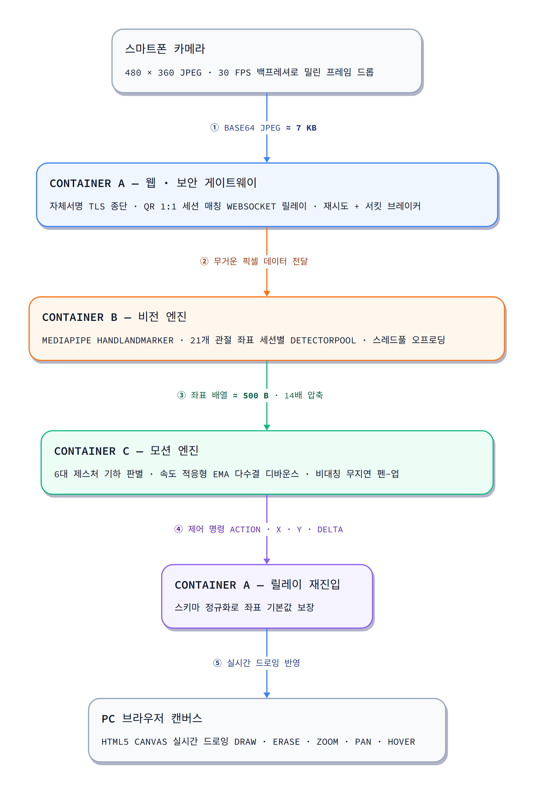

# 🖐️ Air Canvas — 실시간 손동작 인식 원격 그림판

> 스마트폰 카메라로 허공에 손을 움직이면 PC 캔버스에 실시간으로 그림이 그려지는
> **3-Tier 분산 마이크로서비스**

<p align="left">
  
  
  
  
  
</p>

---

## 📌 이 저장소의 핵심

이 프로젝트는 **기능 개발이 아니라, 이미 동작하는 PoC 코드를 프로덕션 레벨로 벼려낸 기록**입니다.

> 돌아가는 코드(AI 모델 + 핵심 로직)는 시스템의 **20%**.
> 나머지 **80%** 는 그것을 실무 환경에서 중단 없이 굴러가게 만드는 **엔지니어링 기반**이다.

6대 제스처는 그대로고 사용자가 보는 화면도 거의 같습니다. 바뀐 것은 **그 기능을 떠받치는 기반**입니다.

### Before vs After — 전부 동일 조건 실측값

| 핵심 지표 | Before (`a6b2596`) | After (`ab41808`) | 개선 |
|---|---:|---:|---|
| **동시 4세션 처리량** | 56.7 fps | **121.6 fps** | **+114% (2.1배)** |
| **동시 4세션 p50 지연** | 69.1 ms | **24.9 ms** | **−64%** |
| **동시 4세션 p95 지연** | 74.4 ms | **47.6 ms** | **−36%** |
| 단일 세션 p50 지연 | 19.7 ms | 19.8 ms | 변화 없음 ¹ |
| **애플리케이션 로그** | **0줄** | 표준 JSON 구조화 로그 | 전 구간 추적 가능 |
| **자동화 테스트** | **0개** | **97개** (전부 통과) | 회귀 방지 |
| 소스 내 사설 IP 리터럴 | 3곳 | **0곳** | 네트워크 종속성 제거 |
| 소스 내 포트 리터럴 | 8곳 | **0곳** | 설정 단일 출처화 |
| 침묵 예외 `except: pass` | 1곳 | **0곳** | 원인 규명 확보 |
| `print()` (서비스 코드) | 4곳 | **0곳** | 포맷 통일 |
| 서비스 헬스체크 | B, C만 (A는 404) | **3개 전부 + Readiness 전이** | 503 통지 |
| CI/CD | 없음 | **GitHub Actions 4-Job** | 자동 검증 |

> ¹ 이번 개선은 **이벤트 루프 블로킹 해소**에서 나왔으므로 **동시 접속에만** 효과가 있습니다.
> 단일 세션은 오히려 로깅·검증 비용으로 평균 1.6 ms 늘었습니다. 관측 가능성의 대가로 판단했습니다.
>
> **측정 조건** — 480×360 JPEG(q=60), 단일 60프레임 / 동시 4세션×60프레임, 동일 PC·CPU 추론.
> `git worktree add /tmp/baseline a6b2596` 로 베이스라인을 재현해 측정했습니다.

---

## 🏛️ 시스템 아키텍처



| 계층 | 역할 |
|---|---|
| **Container A** — 웹 · 보안 게이트웨이 | 자체서명 TLS 종단, QR 1:1 세션 매칭, WebSocket 릴레이, 재시도 + 서킷 브레이커 |
| **Container B** — 비전 엔진 | MediaPipe HandLandmarker로 21개 관절 좌표 추출. **7 KB 픽셀 → 500 B 좌표 (14배 압축)** |
| **Container C** — 모션 엔진 | 좌표 간 기하학적 거리로 6대 제스처 판별, 속도 적응형 EMA로 손떨림 제어 |

---

## 🖐️ 6대 손동작

| 동작 | 손 모양 | 판정 근거 |
|---|---|---|
| **DRAW** (펜) | 검지만 폄 | 검지 tip이 pip보다 위 + 나머지 접힘 |
| **ERASE** (지우개) | 검지 + 중지 (✌️) | 두 손끝 높이차 < `0.12` |
| **ZOOM_IN** (확대) | 주먹 + 엄지만 폄 | 엄지–손바닥 거리 > `0.15` |
| **ZOOM_OUT** (축소) | 주먹 + 새끼만 폄 | delta `−0.008` |
| **PAN** (화면 드래그) | 완전한 주먹 | 엄지–손바닥 거리 < `0.13` |
| **HOVER** (대기) | 그 외 전부 | fallback |

임계값은 전부 [`config/default.yaml`](config/default.yaml)에서 조정합니다. 코드 수정도 재빌드도 필요 없습니다.

---

## 🚀 실행 방법

### 권장 — 호스트 IP 자동 탐지 후 기동

```bash
python scripts/compose_up.py --build
```

```
[+] 호스트 LAN IP 탐지: 192.168.55.208
    PC 접속 : https://localhost:8443
    폰 접속 : https://192.168.55.208:8443
```

컨테이너 **안에서** LAN IP를 탐지하면 Docker 내부 주소(172.x)가 잡혀 폰이 접속할 수 없습니다.
그래서 **호스트에서** 탐지해 주입합니다. 소스코드에는 IP 리터럴이 하나도 없습니다.

<details>
<summary>docker compose 직접 실행</summary>

```bash
HOST_IP=<내 LAN IP> docker compose up --build -d
```

`HOST_IP` 를 비워도 동작하지만, `localhost` 로 접속했을 때 QR이 컨테이너 내부 주소를 가리킬 수 있습니다.
</details>

### 사용 순서

1. PC 크롬에서 `https://localhost:8443` 접속
   *(자체 인증서 경고 → **[고급]** → **[localhost(안전하지 않음)으로 이동]**)*
2. 화면의 **QR 코드를 스마트폰 카메라로 스캔**
3. 폰 브라우저에서 경고 통과 후 **카메라 권한 허용**
4. 카메라에 손을 비추고 **검지를 펴서** 허공에 그리기

---

## 🏗️ 4대 엔지니어링 축

### 1️⃣ 파라미터화 — 설정 단일 출처화

IP, 포트, 제스처 임계값 9종이 코드·Dockerfile·compose·HTML에 흩어져 있었습니다.
값 하나를 바꾸려면 최소 8곳을 동시에 고쳐야 했고, 하나라도 놓치면 조용히 깨졌습니다.

```python
# Before — container_a_web/main.py
DEFAULT_HOST_IP = os.getenv("HOST_IP", "192.168.55.208")   # ← 3곳에 중복
```

발급된 QR을 디코딩하면 `https://192.168.55.208:8443/...` 이었습니다.
이 PC의 LAN IP가 **우연히** 그 값이라 동작했을 뿐, 다른 Wi-Fi로 옮기면 QR이 즉시 죽는 구조였습니다.

```yaml
# After — config/default.yaml (단일 출처)
network:
  host_ip: auto            # 런타임 LAN IP 자동 탐지
gesture:
  thresholds:
    thumb_open_palm_dist: 0.15
  ema:
    alpha_micro: 0.35
    alpha_precise: 0.50
    alpha_fast: 0.85
```

```bash
# 코드 수정 없이 튜닝
AIRCANVAS__GESTURE__EMA__ALPHA_FAST=0.9 docker compose up
```

우선순위: `default.yaml` → `{APP_ENV}.yaml` → 환경변수

---

### 2️⃣ 예외 처리 — 무음 장애에서 통지되는 저하로

```python
# Before — container_a_web/main.py:126
            except Exception:
                pass
```

이 한 줄이 **B 다운, 타임아웃, JSON 파싱 실패, 소켓 단절, 코드 버그**를 전부 삼켰습니다.
사용자는 "그림이 안 그려진다"만 알고, 로그에는 흔적조차 없었습니다.

```python
# After — 예외 종류별 분기 + 전량 로깅
except httpx.TimeoutException:
    log.warning("vision_timeout", session_id=sid, trace_id=tid, ...)
except httpx.ConnectError:
    log.error("vision_unreachable", session_id=sid, trace_id=tid, ...)
except Exception:
    log.exception("frame_relay_failed", session_id=sid, trace_id=tid)   # traceback 보존
```

**재시도 정책은 실시간 특성에 맞췄습니다.** 33 ms마다 새 프레임이 오는데 실패한 프레임을
몇 초씩 붙잡으면 뒤가 밀립니다. → **최대 2회 · 백오프 50 ms · 예산(66 ms) 초과 시 프레임 폐기**,
연속 10회 실패 시 **서킷 OPEN**.

**Graceful Degradation 실측** — `docker stop air-canvas-gesture` 로 모션 엔진을 강제 종료:

| 항목 | Before | After |
|---|---|---|
| A `/health` | **404** (없음) | `200 ok` |
| A `/health/ready` | 없음 | **`503 degraded`** |
| 웹페이지 | 200 | 200 (서비스 지속) |
| 사용자 통지 | **없음** | `STATUS` 메시지 |

```json
{"status":"degraded","checks":{"vision_chain":{"ok":false,"status_code":503,
 "upstream":{"status":"degraded","circuit":"CLOSED","reason":"TIMEOUT"}}}}
```

readiness는 **전이적**입니다. A가 B를, B가 다시 C를 확인합니다.

---

### 3️⃣ 동시성 — 가장 극적인 개선

**문제 1 · 이벤트 루프 블로킹**

```python
# Before — async 핸들러에서 동기 CPU 작업을 직접 호출
@app.post("/analyze")
async def analyze_frame(payload: FramePayload):
    image = decode_base64_frame(payload.image)         # 동기 CPU
    detected, landmarks = extract_landmarks(image)     # 동기 CPU (AI 추론 15~44ms)
```

추론이 도는 동안 **이벤트 루프 전체가 정지**합니다. 다른 세션은 물론 헬스체크도 처리되지 않습니다.

**문제 2 · 단일 AI 모델 공유**

```python
# Before — 전역 1개 + VIDEO 모드 + 벽시계 타임스탬프
hands_detector = mp_vision.HandLandmarker.create_from_options(
    ..., running_mode=mp_vision.RunningMode.VIDEO)     # ← 상태를 가지는 모드
timestamp_ms = int(time.time() * 1000)                 # ← 단조 증가 보장 안 됨
```

VIDEO 모드는 **직전 프레임의 손 위치를 기억**합니다. 모델 1개를 모두가 공유하니
사용자 2명의 추적 상태가 뒤섞였습니다.

**해결 3단계**

```python
# ① 스레드풀 오프로딩
detected, landmarks = await run_in_threadpool(extract_landmarks, image, sid)
```

```python
# ② DetectorPool — 세션별 격리 + 자체 단조 증가 타임스탬프
def __enter__(self):
    self._entry.lock.acquire()
    timestamp_ms = self._entry.next_timestamp_ms   # 벽시계 대신 세션별 번호표
    self._entry.next_timestamp_ms += 33
    return self._entry.detector, timestamp_ms
```

```yaml
# ③ LRU + TTL 자동 회수 (메모리 누수 방지)
vision:
  detector_pool_size: 8       # prod 16
  detector_idle_ttl_s: 120
```

**결과**

```
[동시 4세션 240프레임]
  Before  p50 69.1ms   처리량  56.7 fps
  After   p50 24.9ms   처리량 121.6 fps
          ▲ −64%              ▲ +114%
```

> 수정 전 4세션 p50(69.1 ms)이 단일 세션(19.7 ms)의 약 4배라는 것은
> 요청이 **완전히 직렬 처리**되고 있었다는 증거입니다.

<details>
<summary>💡 작업 순서가 중요했던 이유</summary>

수정 전 코드에서 동시 2세션을 돌렸을 때 **타임스탬프 예외는 재현되지 않았습니다.**
이벤트 루프를 블로킹하므로 호출이 직렬화되어, 같은 밀리초에 두 프레임이 들어갈 일이 없었기 때문입니다.

즉 이것은 *"지금 터지는 버그"* 가 아니라 **"스레드풀을 넣는 순간 터지는 잠재 버그"** 였습니다.
**세션 격리를 먼저 하지 않고 블로킹 해소만 적용했다면 새로운 장애를 만들었을 것입니다.**

`tests/vision/test_detector_isolation.py` 가 실제 MediaPipe로 이를 증명합니다.
</details>

<details>
<summary>📊 계측으로 드러난 사실 — 병목은 전처리가 아니었다</summary>

```json
{"event":"hand_not_detected","detail":{"decode_ms":1.71,"inference_ms":44.12}}
{"event":"hand_not_detected","detail":{"decode_ms":0.49,"inference_ms":15.38}}
```

디코딩 0.5~1.7 ms 대 추론 15~44 ms. 병목은 **모델**입니다.
따라서 전처리 병렬화가 아니라 **동시성 확보**가 옳은 처방이었습니다.
</details>

---

### 4️⃣ 로깅 — 관측 불가에서 관측 가능으로

수정 전 3개 컨테이너의 애플리케이션 로그는 **0줄**이었습니다.

| 컨테이너 | Before |
|---|---|
| A | `print()` 4곳 — **stdout 버퍼링으로 `docker logs` 에 출력조차 안 됨** |
| B | `import logging` 만 하고 **한 줄도 사용 안 함** |
| C | 구조화 로깅 보유 — 단, **쓰이지 않는 WebSocket 경로에만** |

```python
# After — 3개 컨테이너 공통 API
log.info("pc_connected", session_id=sid, detail={"active_rooms": 1})
log.exception("frame_relay_failed", session_id=sid)          # traceback 자동 첨부
log.sampled("frame_relayed", session_id=sid, trace_id=tid)   # N회당 1건
```

```json
{"ts":1788143492214,"time":"2026-08-31T02:31:32.214+00:00","container":"A","level":"INFO",
 "event":"mobile_disconnected","session_id":"after_run",
 "detail":{"frames_received":43,"failed_frames":0,"failure_rate":0.0}}
```

**손상된 프레임 처리 비교** — 깨진 base64 3장 투입:

| | Before | After |
|---|---|---|
| HTTP 응답 | `200 OK` | `200` (degraded 표기) |
| 로그 | **없음** | WARNING + 사유 + 크기 |
| 원인 추적 | **불가능** | 가능 |

```json
{"container":"B","level":"WARNING","event":"frame_rejected","session_id":"p23_run",
 "detail":{"reason":"base64 디코딩 실패: Non-base64 digit found","payload_chars":39}}
```

**스마트 샘플링** — 초당 30프레임을 전량 기록하면 디스크와 성능을 동시에 잡아먹습니다.
첫 발생은 항상 남기고 이후 N회마다 1건, `occurrence` 로 실제 발생 횟수를 보존합니다.
**에러는 절대 샘플링하지 않습니다.**

```json
{"event":"frame_relayed","trace_id":"debug_run-1", "detail":{"sampled_every":30,"occurrence":1}}
{"event":"frame_relayed","trace_id":"debug_run-31","detail":{"sampled_every":30,"occurrence":31}}
```

`trace_id` 하나로 **A 수신 → B 추론 → C 판별 → A 반환** 전 구간을 밀리초 단위로 역추적할 수 있습니다.

---

## ⚙️ CI/CD — 4대 축을 영구적으로 지키는 엔진

```
git push ─▶ ① Lint ─▶ ② test-light ─▶ ④ build
                   └─▶ ③ test-vision
```

| Job | 시간 | 내용 |
|---|---:|---|
| `lint` | 7s | ruff — 문법·미사용 import·import 정렬 |
| `test-light` | 23s | 단위 + 통합 + **4대 축 검증** |
| `test-vision` | 47s | 실제 MediaPipe로 세션 격리·타임스탬프 검증 (모델 캐시) |
| `build` | 1m59s | 3개 이미지 빌드 → healthy 대기 → 스모크 → 로그 스키마 검증 |

### 4대 축을 강제하는 회귀 테스트

[`tests/unit/test_pillars.py`](tests/unit/test_pillars.py) 23개가 안티패턴이 다시 들어오면 **빌드를 깨뜨립니다.**
사람의 코드리뷰에 의존하지 않습니다.

```python
def test_no_silent_exception_swallowing():
    """`except ...: pass` 형태의 침묵 예외가 없어야 한다."""
    for path in _python_files():
        tree = ast.parse(open(path, encoding="utf-8").read())
        for node in ast.walk(tree):
            if isinstance(node, ast.ExceptHandler) and _body_is_only_pass(node):
                violations.append(f"{_rel(path)}:{node.lineno}")
    assert not violations
```

> 이 테스트들은 작성 직후 첫 실행에서 **방금 작성한 코드의 위반 3건**을 잡아냈습니다 —
> `__main__` 블록 포트 리터럴, config 포트 폴백, `detector_pool` 의 `except: pass`.

### 테스트 현황

```
tests/integration/test_container_a.py    10 passed
tests/integration/test_degradation.py     5 passed
tests/unit/test_ema_debounce.py          11 passed
tests/unit/test_gesture_rules.py         42 passed
tests/unit/test_pillars.py               23 passed
tests/vision/test_detector_isolation.py   6 passed
═══════════════════════════════════════════════════
                                         97 passed
```

```bash
pytest              # 전체 (로컬 약 7초)
pytest -m pillars   # 4대 축 검증만
pytest -m vision    # MediaPipe 필요 테스트만
```

카메라 없이 21개 관절 좌표를 합성하는 **랜드마크 팩토리**로 6대 제스처를 결정론적으로 재현합니다.

```python
# tests/conftest.py
def make_hand(index=False, middle=False, ring=False, pinky=False, thumb_x=0.5, ...):
    """MediaPipe 좌표계에서 y는 아래로 갈수록 커진다.
       따라서 '손가락을 폈다' = 끝(tip)이 중간관절(pip)보다 y가 작다."""
```

---

## 📁 프로젝트 구조

```
air-canvas-system/
├── common/                     3개 컨테이너 공유 모듈
│   ├── config.py               설정 로더 (YAML + 환경변수 병합)
│   ├── logging_setup.py        구조화 로거 + 샘플링 + 파일 회전
│   ├── http_client.py          재시도 + 서킷 브레이커
│   ├── schemas.py              서비스 간 응답 계약
│   └── detector_pool.py        세션별 detector 격리
├── config/                     모든 튜닝 값의 단일 출처
│   ├── default.yaml
│   ├── dev.yaml
│   └── prod.yaml
├── container_a_web/            웹 · 보안 게이트웨이
├── container_b_vision/         비전 엔진
├── container_c_gesture/        모션 엔진
├── tests/                      97개 (unit / integration / vision)
├── scripts/compose_up.py       호스트 LAN IP 탐지 후 기동
├── docs/                       발표 자료 · 실측 보고서 · 다이어그램
└── .github/workflows/ci.yml    CI 파이프라인
```

---

## 📚 상세 문서

| 문서 | 내용 |
|---|---|
| [`docs/BEFORE_AFTER_REPORT.md`](docs/BEFORE_AFTER_REPORT.md) | 수정 전/후 실측 비교 보고서 (754줄) |
| [`docs/PRODUCTION_REFINING_PLAN.md`](docs/PRODUCTION_REFINING_PLAN.md) | 진단 26건 + 실행 계획 (1,180줄) |
| [`docs/PRESENTATION.md`](docs/PRESENTATION.md) | 슬라이드별 발표 대본 (화면 구성 + 스크립트) |

---

<div align="center">

**'돌아가는 코드'를 짜는 코더에서 '지속 가능한 시스템'을 설계하는 엔지니어로**

</div>
