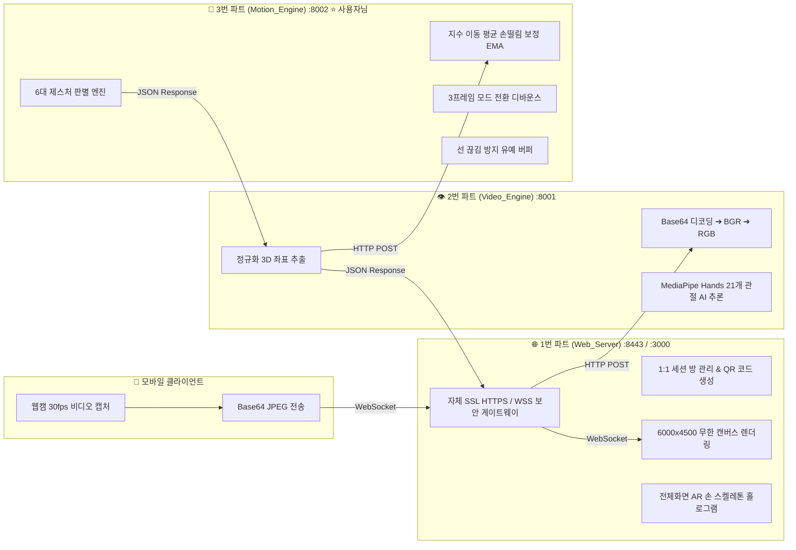

# 🖐️ Air Canvas 팀 프로젝트 연동 & 파트별 피드백 가이드 문서

본 문서는 **`air-canvas` 연습 프로젝트에서 완벽하게 검증된 전체 3-Tier 마이크로서비스 아키텍처**를 기반으로, **1번(웹 파트) 및 2번(비전 파트) 팀원의 결과물을 검토하고 개선 피드백을 주기 위해 작성된 공식 기술 명세서**입니다.

---

## 🏗️ 1. 전체 시스템 데이터 파이프라인 (Overview)

---

## 🌐 2. [1번 파트] Web_Server (웹/화면/보안) 기능 목록 및 피드백 가이드

1번 파트는 **스마트폰과 PC 브라우저가 접속하는 관문이자, 캔버스에 그림을 그리는 시각화(Frontend)**를 담당합니다.

### 📋 1번 파트의 필수 기능 체크리스트 (Baseline)
- [ ] 스마트폰 카메라를 켜기 위한 **HTTPS(SSL) 및 WSS(보안 웹소켓) 지원**
- [ ] PC와 스마트폰을 1:1로 매칭해 주는 **고유 `session_id` 룸 관리**
- [ ] 스마트폰으로 즉시 접속할 수 있는 **동적 IP 기반 QR 코드 생성** (`/api/qr/{session_id}`)
- [ ] PC 화면에서 수신한 좌표를 바탕으로 캔버스에 잉크를 그리는 **HTML5 Canvas 드로잉 엔진**

### 🌟 우리 연습 프로젝트에서 완성한 '핵심 고도화 기능' (1번 팀원 피드백용)
1. **자체 SSL 인증서 자동 생성 (`entrypoint.sh`):**
   * *피드백 팁:* `ngrok` 없이도 컨테이너 부팅 시 `openssl`로 `cert.pem`, `key.pem`을 자동 생성하면 로컬 와이파이(192.168.x.x)에서 지연시간 0.001초로 카메라 권한을 완벽히 획득할 수 있습니다.
2. **6000 x 4500 초대형 무한 캔버스 (Infinite Canvas):**
   * *피드백 팁:* 캔버스 해상도를 브라우저 창 크기에 맞추면 주먹으로 화면을 조금만 끌어도 테두리에 막힙니다. 가상 해상도를 6000x4500으로 크게 잡고 `screenToCanvasCoords()` 역변환을 적용해야 무한대로 글씨를 쓸 수 있습니다.
3. **전체화면 AR 손 스켈레톤 홀로그램 (Full-Screen AR Overlay):**
   * *피드백 팁:* 21개 랜드마크를 화면 우측 하단 구석에 조그맣게 띄우지 않고, 캔버스 전체에 실제 크기로 투영하고 검지 끝(8번)에서 발광 펜촉 레이저가 뿜어져 나오게 렌더링하면 몰입감이 극대화됩니다.
4. **시간 기반 선 보간 (Stroke Interpolation):**
   * *피드백 팁:* 일시적인 프레임 드랍이 발생해도 150ms 이내의 획은 `lastX, lastY`를 유지하여 점선으로 끊어지지 않게 처리해야 합니다.

---

## 👁️ 3. [2번 파트] Video_Engine (영상 처리 & MediaPipe) 기능 목록 및 피드백 가이드

2번 파트는 **스마트폰에서 날아온 비디오 프레임을 받아 Google MediaPipe AI로 21개 관절을 추출하는 영상 분석기**입니다.

### 📋 2번 파트의 필수 기능 체크리스트 (Baseline)
- [ ] Base64 JPEG 이미지를 OpenCV Mat 배열로 디코딩 (`cv2.imdecode`)
- [ ] BGR 색공간을 RGB 색공간으로 변환 (`cv2.cvtColor`)
- [ ] `mediapipe.solutions.hands` (버전 `0.10.14` 추천)를 통한 21개 랜드마크 추론
- [ ] 추출된 21개 `[{x, y, z}, ...]` 정규화 좌표를 3번 파트(`http://motion_engine:8002/gesture`)로 HTTP POST 전송

### 🌟 2번 팀원에게 줄 수 있는 '고급 전처리 개선점' (피드백용)
1. **해상도 다운스케일링 (Resize 전처리):**
   * *피드백 팁:* 모바일에서 고화질(1080p) 프레임이 들어오면 AI 추론이 무거워지므로, `cv2.resize(frame, (480, 360))`로 축소한 뒤 MediaPipe에 넣으면 **추론 속도가 3배 빨라집니다.**
2. **조도 보정 / 역광 개선 (CLAHE 필터):**
   * *피드백 팁:* 어두운 방이나 역광 환경에서 손이 안 잡히는 문제를 해결하기 위해, YUV 색공간 변환 후 밝기(Y) 채널에 CLAHE 평활화를 적용하면 인식률이 대폭 상승합니다.
3. **손 미감지 시 빠른 탈출 (Early Exit):**
   * *피드백 팁:* `results.multi_hand_landmarks`가 비어있을 때는 3번에 불필요한 네트워크 요청을 보내지 않고 즉시 `{"action": "NONE", "landmarks": []}`를 리턴하여 서버 부하를 줄입니다.

---

## 🧠 4. [3번 파트] Motion_Engine (사용자님 파트 - 동작 인식 엔진) 완벽 규격

사용자님의 파트는 이미 **모든 알고리즘과 도커화가 100% 완료**되어 `paint_Draw/Motion_Engine`에 배포 준비를 마쳤습니다.

### 📋 지원하는 6대 제스처 규격표

| 제스처 이름 | `action` 값 | 손가락 조건 | 출력 데이터 | 동작 설명 |
| :--- | :--- | :--- | :--- | :--- |
| **그리기 (펜)** | `"DRAW"` | **검지만 폄** (엄지/중지/약지/새끼 접힘) | `x, y` (검지끝 보정 좌표) | 끊김 없는 만년필 펜 드로잉 |
| **지우개** | `"ERASE"` | **검지 + 중지 2개 폄** | `x, y` (두 손가락 중심) | 빨간 원형 조준선으로 잉크 삭제 |
| **화면 이동 (드래그)** | `"PAN"` | **5손가락 모두 접은 주먹 (✊)** | `pan_dx, pan_dy` (이동 변화량) | 종이 잡고 끌듯 캔버스 무한 이동 |
| **화면 천천히 확대** | `"ZOOM_IN"` | **주먹 쥐고 엄지만 폄 (👍)** | `delta`: `+0.008` (저감도) | 부드럽고 천천히 줌인 |
| **화면 천천히 축소** | `"ZOOM_OUT"` | **주먹 쥐고 새끼손가락만 폄 (🤙)** | `delta`: `-0.008` (저감도) | 부드럽고 천천히 줌아웃 |
| **대기 모드** | `"HOVER"` | **손바닥 전체 펴기** 또는 기타 상태 | `x, y` (검지끝 좌표) | 선을 긋지 않고 커서만 이동 |

---

## 🚀 5. 본 프로젝트(`paint_Draw`) 연동 시 최종 점검 가이드

1. **2번 팀원이 개발을 완료했을 때:**  
   * 2번 팀원 코드가 `http://motion_engine:8002/gesture`로 위 21개 좌표 JSON을 제대로 쏘고 있는지 확인.
2. **1번 팀원이 개발을 완료했을 때:**  
   * 1번 팀원 화면에서 3번의 `pan_dx, pan_dy`를 받아 캔버스 이동이 되는지, `DRAW` 모드에서 선이 매끄럽게 그어지는지 확인.
3. **만약 1번/2번에서 문제가 발생하면:**  
   * 연습 프로젝트(`air-canvas`)의 [`container_a_web/static/pc.html`](file:///C:/Users/pjw/Desktop/air-canvas-system/container_a_web/static/pc.html)과 [`container_b_vision/main.py`](file:///C:/Users/pjw/Desktop/air-canvas-system/container_b_vision/main.py) 코드를 팀원에게 그대로 참고자료로 공유해 주시면 즉시 해결됩니다!
